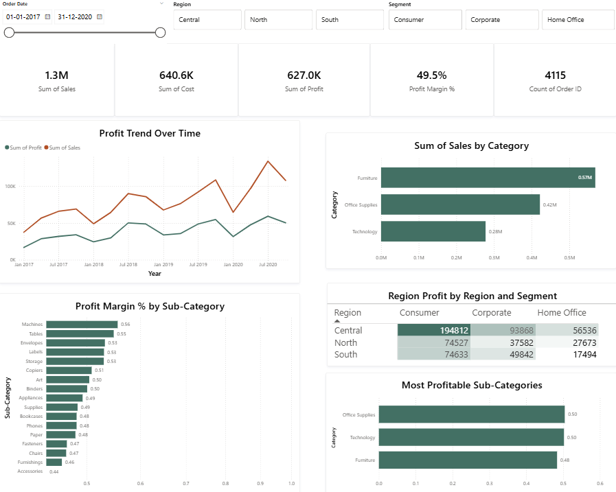

#  Sales Performance Dashboard (Power BI)

##  Overview

This project showcases an interactive Power BI dashboard built to analyze sales performance across regions, product categories, and customer segments. The goal was to transform raw transactional data into meaningful business insights that support data-driven decision-making.

---

##  Objectives

* Track key metrics: Sales, Cost, Profit, and Profit Margin
* Identify high- and low-performing product categories
* Analyze regional and segment-level profitability
* Understand trends in sales and profit over time

---

##  Tools & Technologies

* Power BI
* DAX (Data Analysis Expressions)
* Data Modeling
* Data Visualization

---

##  Dashboard Preview



---


##  Key Features

* KPI cards for Sales, Cost, Profit, Orders, and Profit Margin
* Profit Margin analysis using custom DAX measures
* Time-series trend analysis for profit performance
* Region and segment breakdown using matrix heatmap
* Sub-category level profitability analysis

---

##  Key Insights

* Some sub-categories generate high sales but low profit margins, indicating inefficiencies
* The Central region and Consumer segment contribute the highest overall profit
* Profit trends fluctuate over time, suggesting possible seasonal patterns

---

## DAX Measures Used

```DAX
Total Sales = SUM([Sales])

Total Profit = SUM([Profit])

Total Cost = SUM([Cost])

Total Orders = COUNT([Order ID])

Profit Margin % = DIVIDE(SUM([Profit]), SUM([Sales]), 0)
```

---

## Dataset

* Includes fields such as:

  * Order Date
  * Sales
  * Profit
  * Category
  * Sub-Category
  * Region
  * Segment

---

##  How to Use

1. Download the `.pbix` file from this repository
2. Open in Power BI Desktop
3. Interact with filters (Region, Segment, Date)
4. Explore trends and insights

---

##  Project Highlights

* Focused on business insights, not just visuals
* Applied best practices in dashboard design and layout
* Used DAX to create meaningful performance metrics


